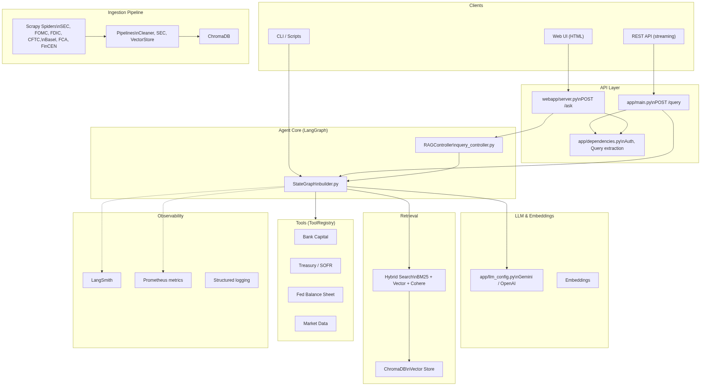
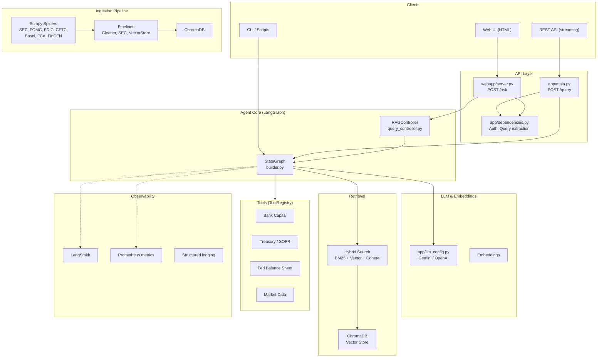
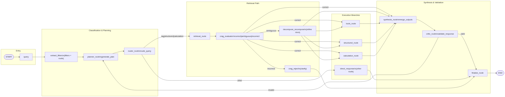
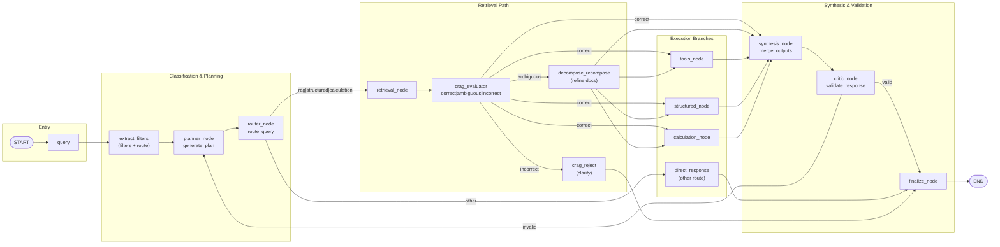
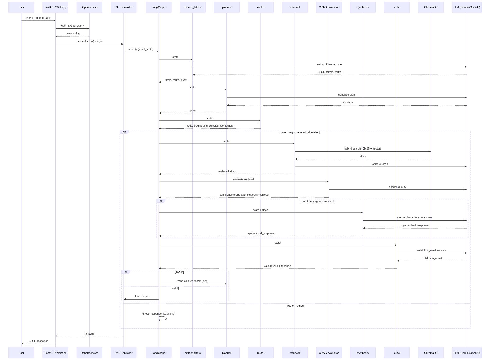
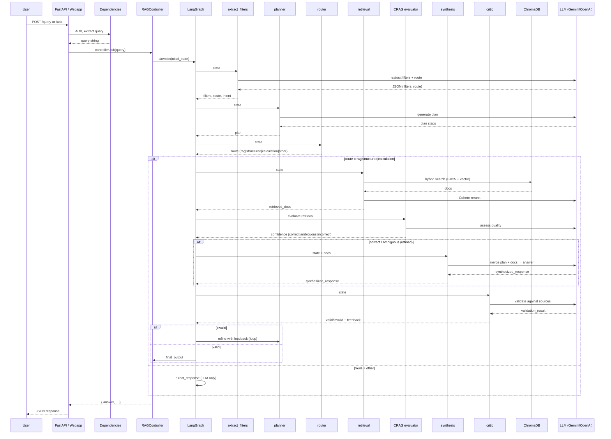

# Financial Regulation Agent — Architecture

## High-Level System Overview

---

## LangGraph Workflow (Agent Pipeline)

---

## Data Flow: Query to Answer

---

## Component Map

| Layer | Components | Purpose |
|-------|------------|---------|
| **Entry** | `app/main.py`, `webapp/server.py`, `scripts/run_agent.py` | HTTP / CLI entry points |
| **Dependencies** | `app/dependencies.py` | API key auth, query extraction, request context |
| **Controller** | `webapp/retrieval/query_controller.py` | Bridges HTTP → LangGraph, timeout, rate-limit handling |
| **Graph** | `graph/builder.py`, `graph/state.py` | LangGraph workflow definition |
| **Nodes** | `graph/nodes/*` | extract_filters, planner, router, RAG, CRAG, tools, structured, calculation, merge, critic |
| **Retrieval** | `retrieval/hybrid_search.py`, `retrieval/vector_store.py` | BM25 + vector + Cohere rerank → ChromaDB |
| **LLM** | `app/llm_config.py` | Gemini / OpenAI, embeddings |
| **Tools** | `tools/registry.py`, `tools/*.py` | Bank Capital, Treasury, Fed Balance Sheet, Market Data |
| **Ingestion** | `ingestion/regcrawler/` | Scrapy spiders, pipelines, Chroma upsert |
| **Observability** | `observability/`, LangSmith, Prometheus | Logging, tracing, metrics |
